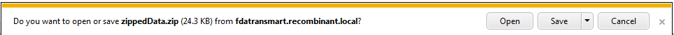
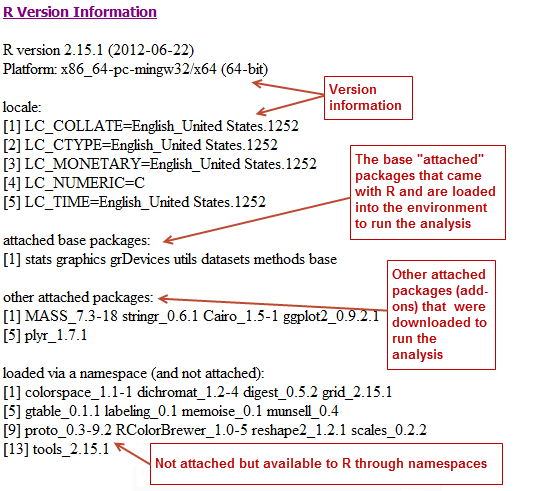
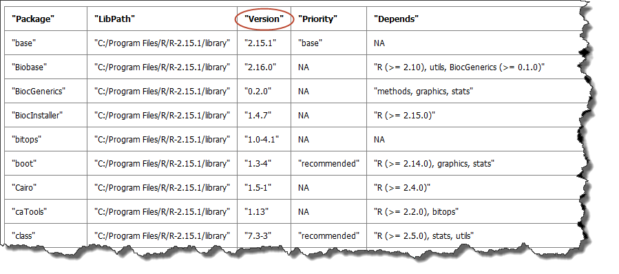

Appendix A: Download R Data
===========================

Analyses run through the Advanced Workflow tool within Analyze use R for
computation. tranSMART allows you to:

-  Download data files that were exported from the tranSMART database
   for use in an analysis. These files can then be used in other
   external tools.

-  Download the R scripts that tranSMART used in the generation of an
   analysis.

-  Review the R version information used for a particular analysis.

-  Export R code and its data from tranSMART so you execute the R code
   in the R program independently of tranSMART.

.. note::
	 For more information on The r Project for Statistical Computing, visit the following site: `www.r-project.org <http://www.r-project.org>`__.   

Downloading Raw R Data
----------------------

To download advanced workflow analyses as raw R data:

#.  Click the tranSMART **Analyze** tool to display the Analyze window.

#.  Select the study you want to use and drag it into a subset
    definition box in Subset 1.

#.  Click the **Advanced Workflow** tab and select the analysis you
    want to run.

#.  Define the variables accordingly.

#.  Click **Run**.

    Your analysis appears below the variable selection boxes.

#.  Click **Download raw R data** at the bottom of the page.

    A dialog box similar to the following appears:

    |download_r_options|

#.  Decide whether you want to open the file or save it to your hard
    drive, then click **OK**.

Reviewing R Version Information
~~~~~~~~~~~~~~~~~~~~~~~~~~~~~~~

To review the R version information for an analysis:

#.  Click the tranSMART **Analyze** tool to display the Analyze
    window.

#.  Select the study you want to use and drag it into a subset
    definition box in Subset 1.

#.  Click the **Advanced Workflow** tab and select the analysis you
    want to run.

#.  Define the variables accordingly.

#.  Click **Run.**

    Your analysis appears below the variable selection boxes.

#.  Click **R Version Information** at the bottom of the page.

    The following R version data displays:

    -   Information about the R installation:

        |adv_rversion|

    -   A table of the packages that are included in the installation.
        Although not all packages may be used, all are listed. The version
        number is especially useful - if you want to re-create an analysis,
        the version number indicates the specific version used to create the
        original analysis.

        This sample shows a portion of the table:

        |adv_rpackages|

You can view the full table in grid format when you select the
**Download raw R data** option. Just click **sessionInfo.txt** to open
the file:

|download_r_sessioninfo|

Export R Code and Data
~~~~~~~~~~~~~~~~~~~~~~

To export R code and data so it is executable in R:

#.  Click the tranSMART **Analyze** tool to display the Analyze
    window.

#.  Select the study you want to use and drag it into a subset
    definition box in Subset 1.

#.  Click the **Advanced Workflow** tab and select the analysis you
    want to run.

#.  Define the variables accordingly.

#.  Click **Run**.

    Your analysis appears below the variable selection boxes.

#.  Click **Download raw R Data** at the bottom of the page.

    A dialog box similar to the following appears:

    |download_r_options|

#.  Open the file and copy the R commands from the file jobcommands.txt.

#.  Be sure you delete the analysis image from the Advanced Workflow page.

#.  Paste the R commands from the downloaded file into R.

#.  Run R. R creates the appropriate analysis image.

Prerequisites for using R
^^^^^^^^^^^^^^^^^^^^^^^^^

#.  When opening R, change the working directory to your downloaded raw R data folder

    .. code:: r

        # In R environment, set your working directory:
        setwd("C:\\users\\username\\Desktop\\workingDirectory").

#.  Install the following packages:

    .. code:: r

        install.packages("plyr")
        install.packages("ggplot2")
        install.packages("Cairo")
        install.packages("rmeta")
        install.packages("visreg")

.. |download_r_sessioninfo| image:: media/download_r_sessioninfo.png
   :width: 5.80292in
   :height: 2.20833in
