Browse
======

.. important::
    This tab is not always activated. It might not appear in your
    tranSMART environment.

The tranSMART Browse feature provides a fine-grained search capability
from a single user interface into studies and other data sources of
interest.

You define a search query by: typing search keywords into the text box,
selecting pre-defined search filters from one or more filter
browsers, or any combination of these methods. tranSMART conducts the
search across multiple data sources.

The Browse feature supports filters based on one or more of the
following kinds of information:

-  Keywords that you specify, such as part of a study or analysis name

-  Reference SNP (RS) identifiers

-  Individual genes and all genes in a gene signature

-  Chromosomes and a specific position within a chromosome

-  Diseases and observations

.. note::
    Administrators only: For information on creating and editing Browse 
    objects, see :ref:`browse-data-administration-label`.   

Overview of the Browse UI
-------------------------

The figure below shows the Browse interface. It is divided into two
panes:

**Left pane**

Here the search filters are defined to retrieve the studies of
interest.

The "Active Filters" area displays any selected, pre-defined filters and 
free-text search keywords that you have typed; for example, the title of a study. 
The "Program Explorer" area displays the matching studies.

**Right pane**

Here information is shown on the studies and any associated
objects (analyses, assays, folders) listed in the Program Explorer.

Some studies displayed in this pane can be opened in the "Analyze" feature,
where you define cohorts within the study and perform a variety of
analyses of the cohort data.

Features of the Browse page are shown below:

|browse_page|

.. _defining-search-filters-label:

Defining Search Filters
-----------------------

You define search filters to retrieve just the resources that interest
you.

Search filters are identical in the Browse and Analyze windows. When you
define a filter, it will be applied in Browse and in Analyze.

This section describes how to use keywords as search filters, using the
boxes above the Active Filters area, and how to select pre-defined
search filters from the `Filter Browser <#using-the-filter-browser>`__.

The search filters you type and that you select from the Filter Browser
are displayed in the `Active Filters <#managing-active-filters>`__.

Keyword Search
~~~~~~~~~~~~~~

The following figure shows the controls for defining a keyword search:

|browse_search_disease|

There are two types of keyword searches:

-  Keyword searches based on dictionaries. These searches apply to all
   categories of pre-defined metadata, such as Disease.

-  Keyword searches based on free-text fields, such as names and
   descriptions, as well as file names and content (for indexed files).
   In Analyze, free-text searches apply to all tree nodes in the
   Navigate Terms pane.

To define a keyword search (any category except Free Text):

#.  Select one of the categories in the category dropdown control, or 
    select **All** to search across all categories.
#.  Specify part or all of a search keyword in the text field to the 
    right of the category dropdown.

.. note::
    Gene searches return all matches of the gene, not just results that are statistically significant.

When you type at least two characters in the field, tranSMART begins to
search within the specified category and lists keywords that begin with
those characters. The search text is not case sensitive.

The following figure shows a list of the keywords displayed when the
characters **il7** are typed and the category **Gene** is selected:

|browse_search_gene_list|

Up to 15 keywords can be displayed at one time. If you don’t see the one
you want, type more characters into the field.

Note that the search looks for matches based on the characters at the
beginning of a keyword (in bold) or, as shown below, at the beginning of
a keyword synonym (in parentheses).

|browse_search_gene_synonym|

Click the keyword you want, but do not press Enter or Return. When you click the keyword, the following actions occur:

-  The search begins immediately. The contents of the Program Explorer
   are updated, and a result is displayed in the right pane.

-  The search filter appears in the Active Filters area:

|browse_filters_active|

You can add more filters by repeating the steps above, by selecting
filters from the Filter Browser, or by a combination of these actions.

.. note::
    Search filters for SNPs, genes, and gene signatures do not filter out studies and analyses 
    that omit the specified SNP or gene. However, the only records returned for an analysis 
    are those that contain the specified SNP or gene. If an analysis contains no references 
    to the SNP or gene, no records are returned for that analysis.   

To define a Free Text keyword search:

#.  Select **Free Text** in the category dropdown control.

#.  Type the entire keyword (consisting of one or more words) and
    press **Enter**.

For example, after you type the following Free Text keyword and press
Enter, tranSMART searches for data sources containing *primary breast tumor* 
but not those containing just *breast tumor*:

|browse_searchtext|

Using the Filter Browser
~~~~~~~~~~~~~~~~~~~~~~~~

The Filter Browser lets you select one or more search filters to include
in your search query.

tranSMART adds all of your search filters, including those you type into
the `keyword search <#keyword-search>`__ field, into the
`Active Filters <#managing-active-filters>`__ area.

To work with the Filter Browser:

|browse_filter|

#.  Click the filter icon in the **Active Filters** box

#.  A list of all filters from which you can select appears.

#.  Click the down arrow next to a filter type to see all available
    entries for that type.

#.  Select the filter(s) you want to use from the list. You can select
    more than one filter from the same filter type or filters from
    different types.

All selections appear in the **Active Filters** pane, along with any
search keywords you might have specified.

Managing Active Filters
-----------------------

The Active Filters area displays the entire search query that you build
using the `keyword search <#keyword-search>`__ feature and/or
`filter browser <#using-the-filter-browser>`__ feature.

Each filter that you define is added to the search query. Each time you
add a filter to the search query, the result set in the right side of
the Browse page is modified to satisfy the entire search query.

The following search query in Active Filters will return data sources
involving melanoma and the human protein MAGA4 or MAGB2:

|browse_filters_multi|

Note the following controls in the Active Filters pane:

|browse_filter_controls|

.. _viewing-studies-in-the-program-explorer-tree-label:

Viewing Studies in the Program Explorer Tree
--------------------------------------------

The Program Explorer displays the results of the search query in the
Active Filters box. As the search query changes, the contents of the
Program Explorer changes along with it.

.. note::
	 Administrators only: For information on creating and editing the objects in the Program Explorer, see :ref:`browse-data-administration-label`.   

The following illustration shows the hierarchy of objects in the Program
Explorer tree. Note that each node in the tree is associated with an
icon that represents the type of object at that node:

|browse_object_tree|

**Program** is the top-level component of the hierarchy whose purpose is
to group related studies together. Most of the time a program is defined
by a molecular target, but it may also be a disease or a pathway.

**Study** is a collection of subjects on which one or several assays
were performed. It can be a clinical trial, a preclinical study, or a
discovery experiment.

.. note::
	 Icons for studies that can be opened in Analyze view are designated by a yellow star ( |icon_studystar| ) on the icon.   

**Assay** is an investigative procedure for qualitatively or
quantitatively assessing the amount or functional activity of an entity.
An assay is defined by a unique experimental protocol.

**Analysis** is a result obtained by analyzing data from a study. In
most cases, an analysis is a signature; that is, a list of molecular
entities affected by a particular experimental condition or phenotype.

**Folders** contain one or several files with information about the
associated program, study, analysis, or assay.

Click an object name to view information about the object in the right
pane of the Browse window.

Viewing and Exporting Files in Browse Folders
---------------------------------------------

Folders are used to store any type of files. You can view and download
files.

To view a file in a folder:

#.  Click the folder name in the Program Explorer tree.

    Information about the folder appears in the right panel, including a
    list of files in the folder.

#.  Click the name of the file to view.

    Files of common formats (such as *.doc* and *.pdf*) will be displayed in the
    corresponding application.

#.  To export files click the **Add to Export** button at the far right of a file to
    export, or click **Export all** to export all files in the folder:

|browse_folder_export|

The files are not exported immediately. Instead, they are added to the
Export Cart.

#.  Optionally, as you continue to work in the Browse window, add files
    from other folders to the Export Cart.

#.  When finished adding files to the Export Cart and ready to export the
    files, click the **Export Cart** button at the top of the Browse
    window:

    |browse_exportcart|

#.  In the Export Files dialog box, click **Export Selected Files**.

.. important::
    tranSMART formats the file to export as a zip file, assigns it the
    name *export.zip*, and downloads the file to the Downloads directory on
    your computer.

    If a file named export.zip already exists in the directory, tranSMART
    changes the name to *export-1.zip* (or *export-2.zip*, *export-3.zip*, und
    so weiter, depending on how many files have been exported previously).

    If multiple files are selected for export on the Export Files dialog
    box, all are downloaded in one zip file.

Opening a Study in Analyze View
-------------------------------

Some studies that have been selected in the Program Explorer tree can be
opened in Analyze view. The icon for these studies is displayed with a
yellow star ( |icon_studystar| ), as shown below:

|browse_study_loaded|

To open these studies in Analyze View, first click the study in the
Program Explorer tree, then click the **Open in Analyze view** button as
shown below:

|browse_study_analyzeview|

tranSMART displays the Comparison tab of the Analyze window and opens
the study you were just viewing in the Browse window.

In both the Analyze and Browse windows, note that the study has been
added to the Active Filters pane, and that the results of the search
query are now restricted to that single study.

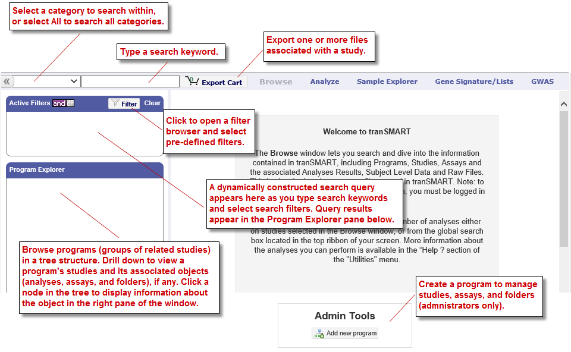
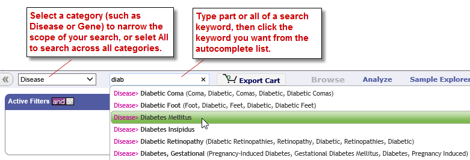
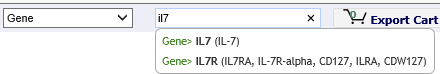
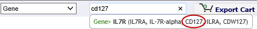
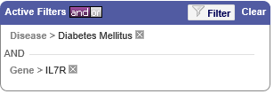
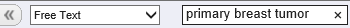

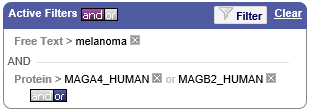
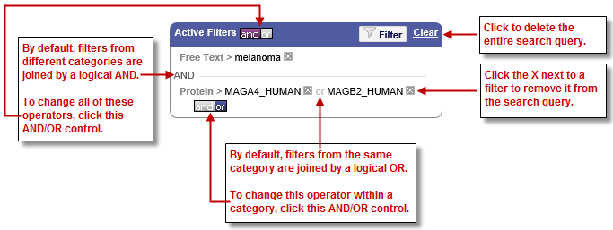
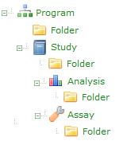

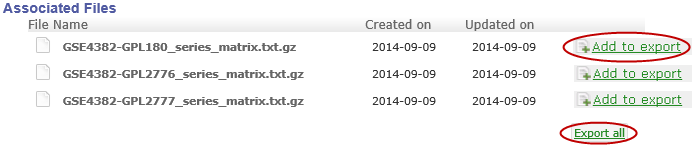

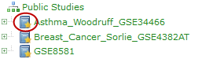
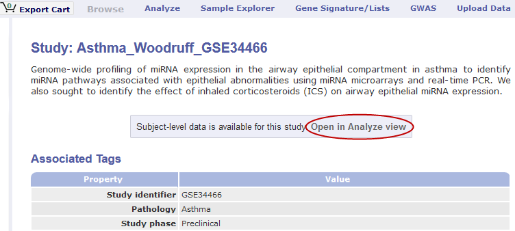
