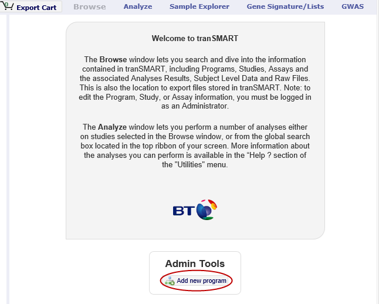
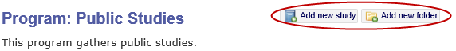
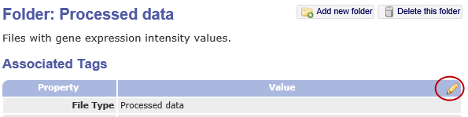
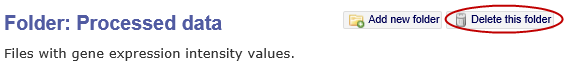
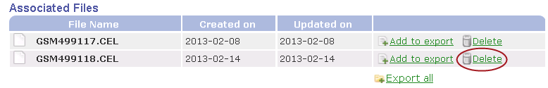
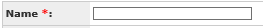
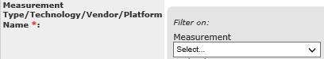
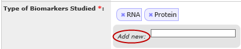
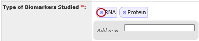

.. _browse-data-administration-label:

Browse Data Administration
==========================

This section describes how to create and modify the following objects in
the Browse Program Explorer:

-  Programs

-  Studies

-  Analyses

-  Assays

-  Folders

For descriptions of these objects, see :ref:`viewing-studies-in-the-program-explorer-tree-label`.

Creating Program Explorer Objects
~~~~~~~~~~~~~~~~~~~~~~~~~~~~~~~~~

A program is the highest-level object in the Program Explorer tree. The
procedure for creating a program is different than for creating all
other objects.

Creating a Program
^^^^^^^^^^^^^^^^^^

To create a program in the Program Explorer:

#.  Click **Browse** in the tranSMART menu bar.

#.  Click **Add new program** under the Welcome to tranSMART box:

    |browse_add_program|

#.  Define the fields in the Create Program dialog box, then click
    **Save**.

Creating Other Program Explorer Objects
^^^^^^^^^^^^^^^^^^^^^^^^^^^^^^^^^^^^^^^

Studies, analyses, assays, and folders are child objects of some other
object. For example, you can create a study under a program, an analysis
under a study, or a folder under an analysis or another folder.

To create a child object:

#.  Select its parent object in the Program Explorer.

    The child objects that can be created under the parent appear as buttons
    in the upper-right corner of the Browse window; for example:

    |browse_program_more|

#.  Click the appropriate button to open the Create... dialog box.

#.  Define the fields in the Create... dialog box, then click **Save**.

    The following table shows the objects you can create for a selected
    object in the Program Explorer:

+---------------------------------------+--------------------------------+
| Selected Object in Program Explorer   | Child Objects You Can Create   |
+=======================================+================================+
| Program                               | -  Study                       |
|                                       |                                |
|                                       | -  Folder                      |
+---------------------------------------+--------------------------------+
| Study                                 | -  Analysis                    |
|                                       |                                |
|                                       | -  Assay                       |
|                                       |                                |
|                                       | -  Folder                      |
+---------------------------------------+--------------------------------+
| Analysis                              | -  Folder                      |
+---------------------------------------+--------------------------------+
| Assay                                 | -  Folder                      |
+---------------------------------------+--------------------------------+
| Folder                                | -  Sub-Folder                  |
+---------------------------------------+--------------------------------+

Editing and Deleting Objects
~~~~~~~~~~~~~~~~~~~~~~~~~~~~

The following table describes how to edit and delete Program Explorer
objects:

+------------------------------------------+------------------------------------------------------------------------------------------------------------------------------------------------------------------------------------------------------------------------------------------+
| Task                                     | Description                                                                                                                                                                                                                              |
+==========================================+==========================================================================================================================================================================================================================================+
| Editing an object                        | To edit an object, click the object in the Program Explorer, then click the pencil icon that appears in the Browse window:                                                                                                               |
|                                          |                                                                                                                                                                                                                                          |
|                                          | |browse_folder_edit|                                                                                                                                                                                                                     |
|                                          |                                                                                                                                                                                                                                          |
|                                          | Define the fields in the Edit... dialog box, then click **Save**.                                                                                                                                                                        |
+------------------------------------------+------------------------------------------------------------------------------------------------------------------------------------------------------------------------------------------------------------------------------------------+
| Deleting analyses, assays, and folders   | To delete an analysis, assay, or folder, click the object in the Program Explorer, then click the **Delete this...** button in the upper right corner of the window; for example:                                                        |
|                                          |                                                                                                                                                                                                                                          |
|                                          | |browse_folder_delete|                                                                                                                                                                                                                   |
|                                          |                                                                                                                                                                                                                                          |
|                                          | **Note:** Normally only analyses, assays, and folders can be deleted from within the Browse window. Programs and studies must be deleted from the database directly unless this feature is enabled in the startup configuration settings.|
+------------------------------------------+------------------------------------------------------------------------------------------------------------------------------------------------------------------------------------------------------------------------------------------+
| Deleting files                           | To delete a file from a folder, click the folder in the Program Explorer, then click the **Delete** button at the right:                                                                                                                 |
|                                          |                                                                                                                                                                                                                                          |
|                                          | |browse_folder_filedelete|                                                                                                                                                                                                               |
+------------------------------------------+------------------------------------------------------------------------------------------------------------------------------------------------------------------------------------------------------------------------------------------+

Common Features for Creating and Editing Objects
~~~~~~~~~~~~~~~~~~~~~~~~~~~~~~~~~~~~~~~~~~~~~~~~

The following table shows the features that apply to all Program
Explorer objects when you are creating or editing an object in a Create...
or Edit... dialog box:

+---------------------------------------------+------------------------------------------------------------------------------------------------------------------------------------------------------------------------------------------------------------------------------------------------------------------------------------+
| Feature                                     | Description                                                                                                                                                                                                                                                                        |
+=============================================+====================================================================================================================================================================================================================================================================================+
| Required fields                             | Fields whose names are followed by a red asterisk are required:                                                                                                                                                                                                                    |
|                                             |                                                                                                                                                                                                                                                                                    |
|                                             | |browse_field_required|                                                                                                                                                                                                                                                            |
+---------------------------------------------+------------------------------------------------------------------------------------------------------------------------------------------------------------------------------------------------------------------------------------------------------------------------------------+
| Autocomplete fields                         | Shaded fields are autocomplete fields. Type one or more characters at the beginning of the value that you want to assign to the field, and tranSMART will display a list of text strings that begin with those characters. Select the value to assign from the displayed list.     |
|                                             |                                                                                                                                                                                                                                                                                    |
|                                             | |browse_field_autocomplete|                                                                                                                                                                                                                                                        |
|                                             |                                                                                                                                                                                                                                                                                    |
|                                             | Alternatively, insert the cursor in the field and press the Down arrow key to select from an alphabetical list of suggested field values.                                                                                                                                          |
+---------------------------------------------+------------------------------------------------------------------------------------------------------------------------------------------------------------------------------------------------------------------------------------------------------------------------------------+
| Multiple-value fields                       | Some autocomplete fields allow multiple values to be assigned. These fields contain the label **Add new** next to the field.                                                                                                                                                       |
|                                             |                                                                                                                                                                                                                                                                                    |
|                                             | |browse_field_multi|                                                                                                                                                                                                                                                               |
+---------------------------------------------+------------------------------------------------------------------------------------------------------------------------------------------------------------------------------------------------------------------------------------------------------------------------------------+
| Removing a value from a multi-value field   | To remove a value from a multi-value field, click the blue **x** icon next to the value:                                                                                                                                                                                           |
|                                             |                                                                                                                                                                                                                                                                                    |
|                                             | |browse_field_multi_delete|                                                                                                                                                                                                                                                        |
+---------------------------------------------+------------------------------------------------------------------------------------------------------------------------------------------------------------------------------------------------------------------------------------------------------------------------------------+
| Close vs. Cancel buttons                    | Both buttons close the Create... or Edit... dialog box, any changes you made in the dialog box are abandoned. However, with **Cancel**, a warning message appears before the dialog box is closed. With **Close**, the dialog box is closed immediately with no warning message.   |
+---------------------------------------------+------------------------------------------------------------------------------------------------------------------------------------------------------------------------------------------------------------------------------------------------------------------------------------+

Uploading Files to Folders
~~~~~~~~~~~~~~~~~~~~~~~~~~

Folders allow you to attach files to an object. For example, you might
add a folder to contain files pertaining to the analysis of a study, or
a gene list for an analysis.

You can upload any type of file to a folder. However, the free-text
search feature will only search files in a format that can be
text-indexed, such as Microsoft Word documents, text files, and
electronically generated PDFs.

Files can be uploaded to a folder via FTP and can be stored on the
application server.

