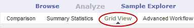
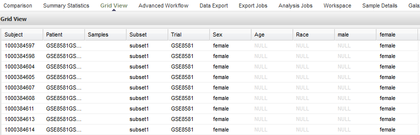
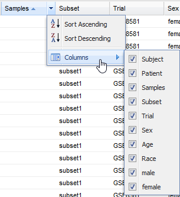

Grid View
=========

This chapter explains how to quickly review basic data and values from
the subset queries for the cohorts you use for analyses.

.. _viewing-analysis-data-in-grid-view-label:

Viewing Data in Grid View
-------------------------

If you are displaying data in the various tables and charts of
Summary Statistics view, and want to view the data in a single table,
use the **Grid View** option.

Access Grid View as follows:

#.  Click the **Analyze** tool and define your cohorts as described earlier in this chapter.

#.  Click **Summary Statistics**.

#.  Click **Grid View**.

    |summary_gridview_tab|

#.  Optionally, you can drag and drop additional points of comparison
    into the grid, and new columns will appear for that data.

#.  You can drag a node from any level of the tree into the grid.

Sample of Grid View for a public study:

|summary_gridview_table|

.. note::
    The ID assigned in the **Subject** column is the internal tranSMART ID that is assigned at the time of data loading. 
    The ID in the **Patient** field contains the original subject ID that was provided in the data.   

    And, also the Grid View allows you to use high dimensional data, see :ref:`hidome-label`.

Grid View Display Options
~~~~~~~~~~~~~~~~~~~~~~~~~

-   **Sort the grid by a specific column.** Click the down-arrow icon
    (|icon_dropdown|) next to the column heading you want to sort by, then
    select **Sort Ascending** or **Sort Descending**.

-   **Hide or redisplay columns.** Click the down-arrow icon next to any
    column heading, click **Columns** as shown below, then select or
    deselect columns to hide or redisplay:

    |summary_gridview_sort|

If a column name does not appear in the menu, you have not included the
associated concept in the analysis. For example, Diagnosis has not been
included in the analysis above.

