Summary Statistics
==================

This chapter explains how to quickly review basic statistics about the
cohorts you use for analyses.

.. _generating-summary-statistics-label:

Generating Summary Statistics
-----------------------------

Once you have finished defining criteria for the cohorts to compare — the
subsets — then click the **Summary Statistics** button.

.. note::
    As an alternative to generating summary statistics, you can view a breakdown 
    of a particular subset by a selected concept (see `View Subset Breakdown by Concept`_).   

tranSMART displays tables and charts of information that describe the
subsets. The information is displayed in Summary Statistics view in the
following sections:

    A summary of the criteria used to define subsets to compare.

    For example:

    |summary_queries|

    A table showing the number of subjects in each subset that match the subset criteria.

    For example:

    |summary_totals|

    In this example, 58 subjects matched the criteria for Subset 1 and
    63 matched the criteria for Subset 2. No (0) subjects matched the
    criteria for both subsets.
   
    Tables and charts that show how the subjects who match the criteria
    fit into age, sex, and race demographics.

    This example shows the age portion of the demographics data only:

    |summary_age|

    Analyses of the concepts you added to the subsets from the navigation
    tree. The data displayed reflects the data used to generate the
    summary statistics.

The next examples show analysis of concepts for a non-linked event, a
linked event, and NGS data.

    |summary_nonlinked|

    **Example 1: Non-linked event.**: this example shows the analysis of the chemotherapy concept.

    |summary_linked|

    **Example 2: Linked event.**: this example shows the analysis of concepts for adverse events.

    |summary_ngs|

    **Example 3: NGS data.**: this example shows the analysis of concepts for description of planned arm.

Significance Tests
~~~~~~~~~~~~~~~~~~

The analyses include the results of significance testing that Analyze
performs:

|summary_ttest|

Significance testing is designed to indicate whether the reliability of
the statistics is 95% or greater, based on p-value.

Analyze calculates the significance result using either t-test or
chi-squared statistics to determine the p-value:

-   For continuous variables (for example, subject weight or age), a
    t-test compares the observed values in the two subsets.
    
-   For categorical values (for example, diagnoses), a chi-squared test
    compares the counts in the two subsets.

    See `this <https://commons.apache.org/proper/commons-math/javadocs/api-2.2/org/apache/commons/math/stat/inference/TestUtils.html>`__ 
    for the Java methods that calculate the chi-squared and t-test statistic.

If there is not enough data to calculate a test, Analyze displays a
message indicating the insufficient quantity of data. In addition,
significance test results are not displayed in the following
circumstances:

-   If two identical subsets are defined. In this case, the significance
    test results are not meaningful.

-   If all subjects in the first subset have one set of values for the
    categorical value and all subjects in the second subset have other
    categorical values. For example, suppose you set Subset 1 to contain
    only males and Subset 2 to contain only females. If you then try to
    show statistics by gender, tables similar to the following would
    result:

    |summary_chi2_disjoint|

    In this case, the chi-squared function doesn’t return meaningful
    results.

View Subset Breakdown by Concept
~~~~~~~~~~~~~~~~~~~~~~~~~~~~~~~~

Generating summary statistics provides data for all subsets defined by
study cohorts. You can view data for a particular subset, however, as
follows:

#.  Select a cohort from the navigation tree and drag it into a subset; for example:

    |summary_single_subset|

#.  Click the **Summary Statistics** tab.

#.  Drag and drop a folder from the navigation tree into the empty page;
    for example:

    |summary_single_drag|

#.  tranSMART calculates the results and displays the data for the given subset and concept:

    |summary_single_results|

.. note::
    The Summary Statistics allows you to use high dimensional data as well, see :ref:`hidome-label`.
  

Defining Points of Comparison
-----------------------------

Once you establish the subsets of subjects that you want to compare, you
can apply one or more points of comparison to the subsets. A *point of
comparison* is a concept in the navigation tree.

To apply a point of comparison to the subsets:

#.  You must already have defined the subsets and have generated summary 
    statistics for the subsets, as described in the previous section.

#.  Drag the concept that you want to introduce as the point of
    comparison from the navigation tree and drop it anywhere inside
    the Summary Statistics view.

As soon as you drop the point of comparison into the Summary Statistics
view, tranSMART begins to compare the subsets based on that point of
comparison. When finished, tranSMART displays a side-by-side summary of
how the subjects in each subset match or respond to the point of
comparison.

Results of a Comparison
~~~~~~~~~~~~~~~~~~~~~~~

In a comparison of subjects in a psychological study, suppose Subset 1
contains subjects with a substance abuse problem and Subset 2 contains
subjects with no substance abuse assessment.

After the subsets are defined and summary statistics are generated, a
diagnosis of depression is dropped into the Summary Statistics view as a
point of comparison. tranSMART displays a side-by-side comparison of the
subjects in each subset, indicating that almost all the subjects with a
substance abuse problem have been diagnosed with depression, while that
diagnosis for those with no substance abuse problem is more evenly
split.

The comparison is placed at the top of the Summary Statistics view,
above the demographic definitions plus any other earlier comparisons:

|summary_single_diagnosis|

.. note::
    To keep the size of the preceding figure within production limits, 
    the demographics (age, sex, and race) portions of the figure are excluded.

.. note::
    Query details accessed through the **Summary** button do not reflect points of comparison.

    
Printing the Contents of Summary Statistics View
------------------------------------------------

You can print the contents of Summary Statistics view as shown below.

#.  In Summary Statistics view, click the **Print** button:

    |summary_print|

    The entire contents of Summary Statistics view appear in a separate browser window.

#.  Click **Print this page**.

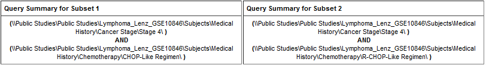
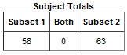
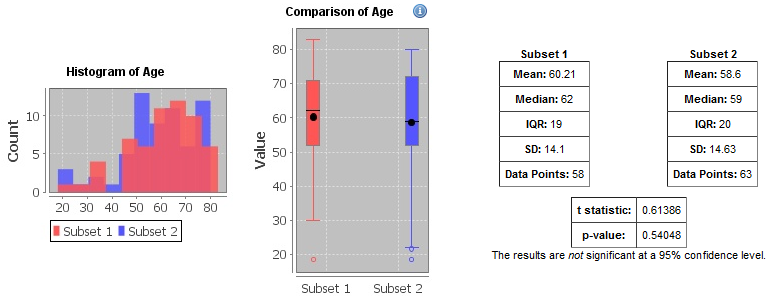
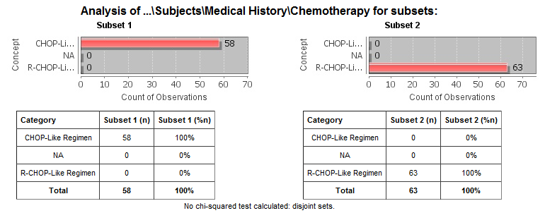
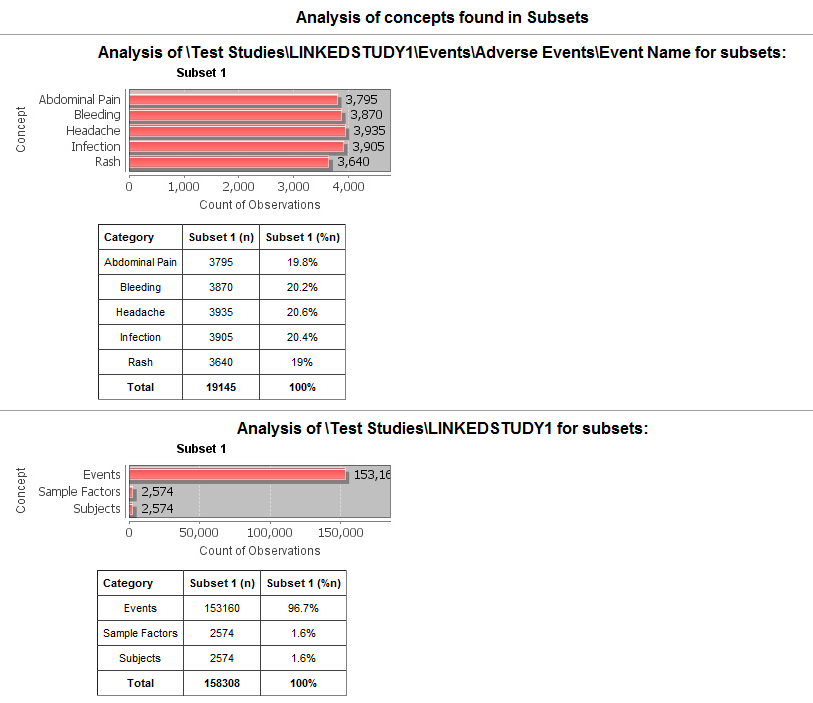
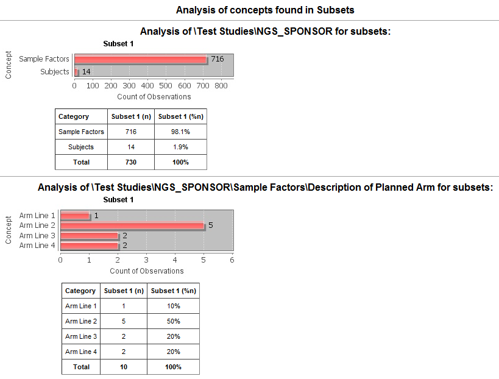
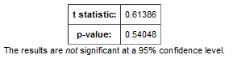
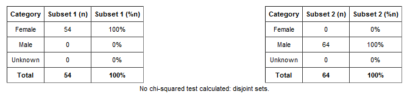
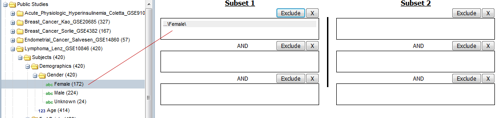
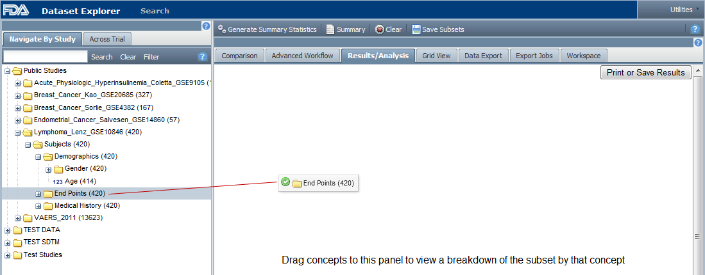
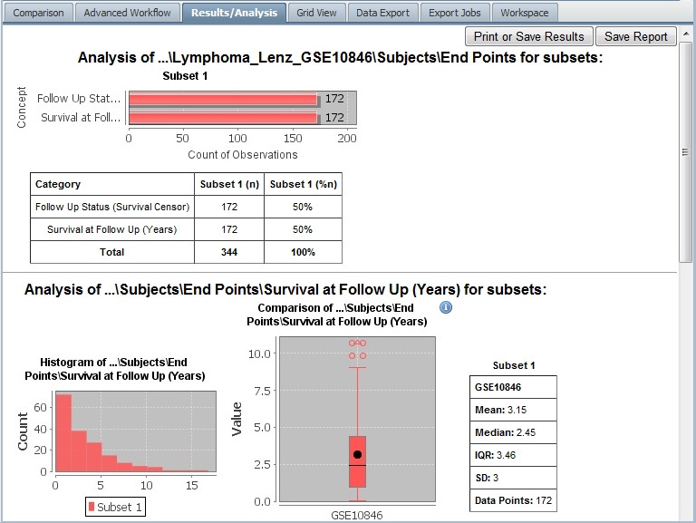
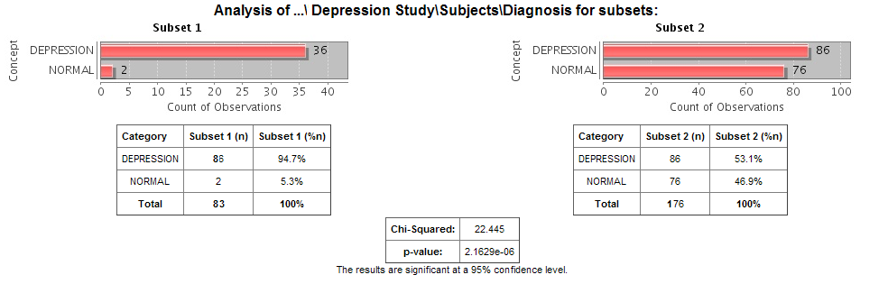
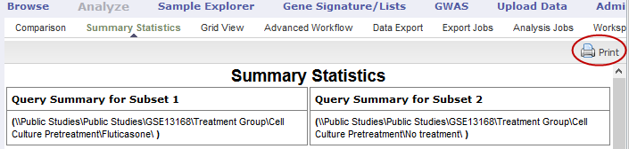
